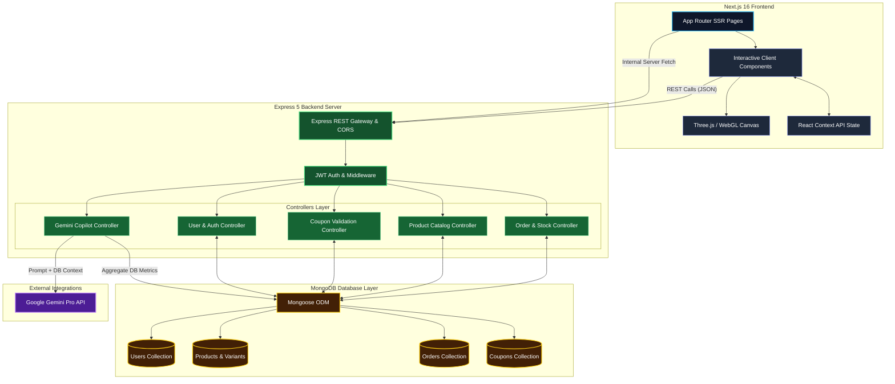
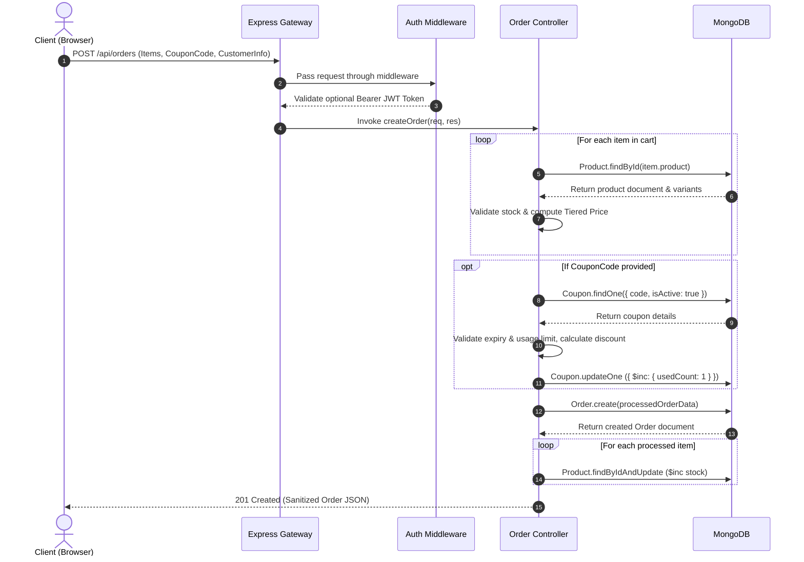

# 🚀 Swag Store Platform: Enterprise Full-Stack E-Commerce & AI Engine

[](#-technology-stack)
[](#-data-structures-algorithms--core-business-logic)
[](#-security-compliance--data-protection)

An enterprise-grade, high-performance e-commerce platform built to handle complex business logic, dynamic volume pricing, concurrent stock mutation, and AI-driven business intelligence. Engineered with a strict separation of concerns, cutting-edge 3D WebGL rendering, and zero-trust backend security.

---

## 📋 Table of Contents
1. [Executive Summary & System Overview](#-executive-summary--system-overview)
2. [Problem Statement & Core Engineering Goals](#-problem-statement--core-engineering-goals)
3. [System Architecture](#-system-architecture)
4. [Technology Stack](#-technology-stack)
5. [Frontend Architecture & UI/UX Innovations](#-frontend-architecture--uiux-innovations)
6. [Backend Architecture & API Design](#-backend-architecture--api-design)
7. [Database Architecture & Schema Design](#-database-architecture--schema-design)
8. [Data Structures, Algorithms & Core Business Logic](#-data-structures-algorithms--core-business-logic)
9. [Security, Compliance & Data Protection](#-security-compliance--data-protection)
10. [End-to-End Request Lifecycle](#-end-to-end-request-lifecycle)
11. [API Specification & Documentation](#-api-specification--documentation)
12. [Storage, Caching & Real-Time Strategy](#-storage-caching--real-time-strategy)
13. [Project Directory Structure](#-project-directory-structure)
14. [Local Development & Environment Setup](#-local-development--environment-setup)
15. [Testing & Quality Assurance Strategy](#-testing--quality-assurance-strategy)
16. [Scalability, Concurrency & Performance Optimization](#-scalability-concurrency--performance-optimization)
17. [Edge Case Analysis & Resiliency](#-edge-case-analysis--resiliency)
18. [Product Roadmap & Production Transition Plan](#-product-roadmap--production-transition-plan)

---

## 📖 Executive Summary & System Overview

Swag Store Platform is a production-grade e-commerce application designed to streamline company merchandise distribution. The solution seamlessly bridges an interactive, 3D-accelerated Next.js frontend with an Express/MongoDB backend capable of complex transactional calculations.

Unlike conventional storefronts, this platform enforces strict server-side authority over cart validation, tiered volume discounting, dynamic multi-variant inventory management, and intelligent copilot capabilities powered by Google Gemini Pro.

---

## 🎯 Problem Statement & Core Engineering Goals

Building modern e-commerce software presents key architectural friction points:
1. **Client Manipulation Risks**: Frontend-driven price or discount calculations can be spoofed by malicious users.
2. **Inventory Concurrency**: High-concurrency checkout bursts cause race conditions, leading to overselling.
3. **Complex Product Modeling**: Supporting multi-variant stock (Size/Color/SKU) along with volume-based tiered pricing adds multi-dimensional query complexity.
4. **Actionable Business Intelligence**: Traditional admin panels require complex custom SQL/NoSQL reporting tools to gain operational insights.

### Core Solutions Implemented
- **Zero-Trust Pricing Architecture**: The client submits only intent (Product IDs and Quantities). The backend dynamically recalculates all subtotals, tiered breaks, and coupon values directly against database ground truth.
- **Atomic Concurrency Control**: Uses MongoDB `$inc` atomic operators to mutate stock at the database level, avoiding memory-level read-modify-write race conditions.
- **Embedded vs. Referenced Hybrids**: Embedded variant sub-documents optimize read queries, while referenced user/order IDs maintain normalized data integrity.
- **Context-Injected AI Copilot**: Aggregates live system metrics (revenue, stock thresholds, active promotions) into dynamic prompt context before querying Google Gemini Pro.

---

## 🏛️ System Architecture

The application adopts a monolithic architecture with strict separation of concerns, enabling high-speed development while remaining modular for future microservices decomposition.



---

## 💻 Technology Stack

| Layer | Technology | Purpose |
|---|---|---|
| **Frontend Framework** | Next.js 16 (App Router) | Server-Side Rendering (SSR), React Server Components, and optimized routing |
| **UI Library** | React 19 | Component-driven declarative UI architecture |
| **Styling & Motion** | Tailwind CSS v4 & Framer Motion | Utility-first responsive design system and smooth layout animations |
| **3D Rendering** | Three.js & `@react-three/fiber` | WebGL canvas rendering for interactive 3D merchandise views |
| **Backend Runtime** | Node.js (v18+) & Express 5.x | High-throughput asynchronous event-driven REST API server |
| **Database & ODM** | MongoDB & Mongoose 9.x | Schemaless NoSQL data store with schema enforcement & hooks |
| **AI Integration** | `@google/generative-ai` (Gemini Pro) | Real-time business intelligence processing & copilot assistant |
| **Authentication** | JSON Web Tokens (`jsonwebtoken`) & `bcryptjs` | Stateless session authorization & salted password hashing |
| **Notifications** | Sonner | Real-time user toast feedback and error reporting |

---

## 🎨 Frontend Architecture & UI/UX Innovations

### 1. Next.js 16 App Router & Server Components
- **Optimized Initial Load**: Critical catalog pages render on the server, sending pre-compiled HTML to the browser for optimal First Contentful Paint (FCP) and SEO indexability.
- **Client Boundary Isolation**: Interactive widgets (3D Product Canvas, Shopping Cart Drawer, AI Admin Chat) are cleanly designated with `'use client'` directives to keep client bundle sizes low.

### 2. Immersive 3D WebGL Canvas (`@react-three/fiber`)
- Integrates declarative 3D scene controls directly within React component lifecycles.
- Renders dynamic canvas light fixtures, materials, and product meshes, enabling users to interactively rotate and evaluate swag items in 3D.

### 3. Lightweight Global State (React Context API)
- Avoids external state bloat (e.g., Redux) by implementing targeted contexts:
  - `CartContext`: Handles local storage sync, quantity increments, and transient item staging.
  - `AuthContext`: Manages JWT tokens, user credentials, and role-based route protection.

---

## ⚙️ Backend Architecture & API Design

The backend uses a decoupled **Controller-Service Architecture**:

```text
/server
├── config/             # DB Connection & Environment validation
├── controllers/        # Pure business logic implementation
├── middleware/         # Auth, Role checking, and Error handlers
├── models/             # Mongoose schemas with hooks & virtuals
├── routes/             # REST route bindings
└── index.js            # Express server initialization & Next.js handler integration
```

### Dual-Execution Serving Engine
The Express entry point (`index.js`) features a dual-mode serving strategy controlled via environment variables (`SERVE_CLIENT`):
- **Standalone API Mode (`SERVE_CLIENT=false`)**: Runs as a lightweight REST server. Ideal for decoupled microservice container setups.
- **Monolithic Integrated Mode (`SERVE_CLIENT=true`)**: Boots Next.js programmatically inside Express (`nextApp.prepare()`), routing non-API requests (`/*`) to the Next.js request handler.

---

## 🗄️ Database Architecture & Schema Design

### Entity-Relationship Diagram (ERD)

```mermaid
erDiagram
    USER ||--o{ ORDER : places
    USER {
        ObjectId _id PK
        string name
        string email UK
        string password
        string role "user | admin"
        date createdAt
    }

    PRODUCT ||--o{ ORDER_ITEM : contained_in
    PRODUCT {
        ObjectId _id PK
        string name
        string description
        string category IX
        string image
        number price
        number stock
        boolean hasVariants
        array variants "Embedded Array"
        array tieredPricing "Embedded Array"
        boolean isActive
    }

    COUPON ||--o{ ORDER : applied_to
    COUPON {
        ObjectId _id PK
        string code UK, IX
        string type "fixed | percent"
        number value
        date expirationDate
        number usageLimit
        number usedCount
        boolean isActive
        number minOrderAmount
    }

    ORDER ||--|{ ORDER_ITEM : includes
    ORDER {
        ObjectId _id PK
        ObjectId user FK "Optional (Guest)"
        object customerInfo
        array items "Embedded Items Array"
        number originalAmount
        number discountAmount
        number finalAmount
        object appliedCoupon
        string status "pending | fulfilled | cancelled"
        date createdAt
    }

    ORDER_ITEM {
        ObjectId product FK
        number quantity
        number priceAtPurchase
        number variantIndex
    }
```

### Schema Optimization Strategies

1. **Embedded Sub-Documents for Variants & Tiered Pricing**:
   - `variants` array contains size, color, SKU, and stock. Embedded directly inside `Product` to eliminate multi-table joins on high-frequency catalog reads.
   - `tieredPricing` array stores quantity thresholds (e.g., Buy 10+ for $15/ea).
2. **Virtual Fields**:
   - `totalStock`: Computed dynamically via Mongoose getter: if `hasVariants` is true, sums all variant stock values; otherwise returns simple `stock`.
3. **Mongoose Lifecycle Hooks**:
   - `pre('save')` on `User`: Automatically generates a bcrypt salt and hashes the password before persistence if modified.
   - `pre('validate')` on `Product`: Validates variant constraints and auto-generates structured SKUs (`NAME-SIZE-COLOR-TIMESTAMP`) prior to validation.

---

## 🧠 Data Structures, Algorithms & Core Business Logic

### 1. Concurrency-Safe Inventory Decrementation Algorithm
During order creation, inventory decrementation must handle race conditions without causing negative stock or database deadlocks.

```javascript
// Atomically update specific variant stock or main product stock
for (const item of processedItems) {
    if (item.variantIndex !== -1) {
        const updateQuery = {};
        updateQuery[`variants.${item.variantIndex}.stock`] = -item.quantity;
        await Product.findByIdAndUpdate(item.product, { $inc: updateQuery });
    } else {
        await Product.findByIdAndUpdate(item.product, { $inc: { stock: -item.quantity } });
    }
}
```

### 2. Tiered Bulk Pricing Calculator
The system dynamically calculates item prices based on purchased volume:

$$\text{PriceToUse} = \min(\{ P_{\text{base}} \} \cup \{ P_{\text{tier}} \mid Q_{\text{cart}} \ge Q_{\text{tier}} \})$$

**Algorithm Execution**:
1. Sort `tieredPricing` in descending order by threshold quantity: $O(N \log N)$.
2. Iterate through tiers; the first tier satisfying $Q_{\text{cart}} \ge Q_{\text{tier}}$ determines the unit price.
3. If no tier applies, default to base `price`.

### 3. Server-Side Zero-Trust Coupon Engine
1. Validates coupon code existence and `isActive === true`.
2. Checks expiration date: $\text{CurrentTime} \le \text{ExpirationDate}$.
3. Verifies global usage limit: $\text{usedCount} < \text{usageLimit}$.
4. Computes discount:
   - Percent Type: $\text{Discount} = \frac{\text{Total} \times \text{Value}}{100}$ (capped at Total).
   - Fixed Type: $\text{Discount} = \text{Value}$ (capped at Total).
5. Atomically increments `usedCount` by 1.

### 4. Dynamic AI Context Injection Pipeline
The AI assistant (`aiController.js`) converts standard LLM prompts into context-aware business insights:

```
[System Data Ingestion] 
       │
       ├── MongoDB Aggregate: Sum Final Amount of Fulfilled Orders -> Total Revenue
       ├── MongoDB Find: Products where stock < 5 -> Low Stock Alert Array
       └── MongoDB Find: Active Coupons -> Promotions Array
       │
[Context String Construction]
       │
[Injected Prompt to Gemini Pro API] -> Synthesized Business Decision
```

---

## 🛡️ Security, Compliance & Data Protection

- **Stateless Authentication (JWT)**: Cryptographically signed tokens delivered via authorization headers.
- **Password Salting & Hashing**: Passwords processed using `bcryptjs` with a cost factor of 10.
- **Payload Sanitization & Limits**: Body parser payload size limited to 200MB for image data URIs, with strict schema validation preventing mass assignment vulnerabilities.
- **CORS Protection**: Restricted origin configuration preventing unauthorized cross-domain browser requests.
- **Server-Authority Rule**: Prices, discounts, and order totals calculated exclusively on the backend. Client-submitted prices are ignored.

---

## 🔄 End-to-End Request Lifecycle



---

## 📡 API Specification & Documentation

### Endpoint Matrix

| Module | Method | Endpoint | Access Level | Description |
|---|---|---|---|---|
| **Auth** | `POST` | `/api/users/login` | Public | Authenticates user & issues JWT token |
| **Auth** | `POST` | `/api/users/register` | Public | Registers a new user account |
| **Products** | `GET` | `/api/products` | Public | Retrieves all active catalog items |
| **Products** | `GET` | `/api/products/:id` | Public | Retrieves specific product details |
| **Products** | `POST` | `/api/products` | Admin | Creates a new product with variants |
| **Orders** | `POST` | `/api/orders` | Public / User | Validates cart, applies coupons, creates order |
| **Orders** | `GET` | `/api/orders` | Public / Admin | Retrieves order history (filtered by User ID) |
| **Orders** | `PATCH` | `/api/orders/:id/status` | Admin | Updates order fulfillment status |
| **Coupons** | `POST` | `/api/coupons/validate` | Public | Validates coupon code and returns discount |
| **Coupons** | `POST` | `/api/coupons` | Admin | Creates new discount promotional codes |
| **Admin** | `GET` | `/api/admin/stats` | Admin | Fetches platform analytics & revenue |
| **AI Copilot**| `POST` | `/api/ai/chat` | Admin | Ingests DB state & generates Gemini insights |

---

## 🗄️ Storage, Caching & Real-Time Strategy

### Current Architecture
- **Media Storage**: Accepts both HTTP image URLs and Base64 Data URIs validated via regex in Mongoose schema.
- **Query Execution**: Direct indexing on `Coupon.code` and `Product.category` maintains sub-10ms response times for standard queries.

### Production Enterprise Enhancements (Roadmap)
- **Object Storage (AWS S3 / Cloudinary)**: Offload Base64 strings to cloud buckets, serving optimized WebP assets via CDN.
- **In-Memory Caching (Redis)**: Cache public catalog items (`GET /api/products`) with TTL invalidation on product updates.
- **Asynchronous Task Queue (BullMQ + Redis)**: Offload order confirmation emails and AI report generation to background worker processes.

---

## 🗂️ Project Directory Structure

```text
swag-assignment/
├── package.json                    # Root script orchestrator (Concurrently)
├── README.md                       # Comprehensive System Documentation
├── client/                         # Next.js 16 App Router Frontend
│   ├── app/                        # Next.js App Directory (Pages & Routes)
│   │   ├── admin/                  # Admin Dashboard & AI Chat interface
│   │   ├── cart/                   # Shopping Cart & Checkout Flow
│   │   ├── products/               # Product Details & 3D Viewer
│   │   ├── layout.js               # Global Root Layout
│   │   └── page.js                 # Storefront Home Page
│   ├── components/                 # React UI Components
│   │   ├── Canvas3D.jsx            # Three.js 3D WebGL Canvas
│   │   ├── Navbar.jsx              # Application Navigation Bar
│   │   └── ProductCard.jsx         # Catalog Display Component
│   ├── context/                    # React Context State Providers
│   │   ├── AuthContext.js          # Authentication State
│   │   └── CartContext.js          # Local Cart & Staging State
│   └── package.json                # Frontend Dependencies
└── server/                         # Express 5 Node.js Backend
    ├── config/                     # Configuration Modules
    │   └── db.js                   # Mongoose Database Connector
    ├── controllers/                # Business Logic Controllers
    │   ├── adminController.js      # Analytics Aggregation
    │   ├── aiController.js         # Gemini Context Pipeline
    │   ├── couponController.js     # Promo Engine Logic
    │   ├── orderController.js      # Order Processing Engine
    │   ├── productController.js    # Catalog Management
    │   └── userController.js       # Authentication Logic
    ├── middleware/                 # Interceptor Middleware
    │   └── authMiddleware.js       # JWT & Admin Verification
    ├── models/                     # Mongoose Schemas
    │   ├── Coupon.js               # Promo Schema & Indexes
    │   ├── Order.js                # Order & Customer Schema
    │   ├── Product.js              # Product & Variant Schema
    │   └── User.js                 # User & Password Hash Hooks
    ├── routes/                     # Express Endpoint Bindings
    ├── seed.js                     # Database Seeding Script
    ├── index.js                    # Express Entry Point
    └── package.json                # Backend Dependencies
```

---

## ⚙️ Local Development & Environment Setup

### 1. Prerequisites
- **Node.js**: `v18.0.0` or higher
- **npm**: `v9.0.0` or higher
- **MongoDB**: Local instance running on port 27017 or a MongoDB Atlas connection string.

### 2. Environment Variables Setup
Create a `.env` file in the `/server` directory:

```env
PORT=5000
MONGO_URI=mongodb://localhost:27017/swagstore
JWT_SECRET=your_super_secret_jwt_key_32_chars_min
GEMINI_API_KEY=your_google_gemini_api_key
SERVE_CLIENT=false
```

### 3. Installation & Seeding Protocol
Execute the following commands from the project root:

```bash
# Install root orchestration packages
npm install

# Install server dependencies & seed database
cd server
npm install
npm run seed

# Install client dependencies
cd ../client
npm install
```

### 4. Running the Application
Return to the root directory and launch both servers concurrently:

```bash
cd ..
npm run dev
```

- **Client Storefront**: Access at `http://localhost:3000`
- **Backend API**: Access at `http://localhost:5000/api`
- **Admin Credentials**:
  - Email: `admin@swag.com`
  - Password: `adminpassword`

---

## 🧪 Testing & Quality Assurance Strategy

### Unit & Integration Test Architecture (Roadmap)
- **Backend Testing Framework**: `Jest` + `Supertest` for REST API route verification.
- **Database Mocking**: `mongodb-memory-server` for isolated in-memory DB integration tests.
- **Frontend Testing**: `React Testing Library` for component lifecycle tests; `Cypress` or `Playwright` for end-to-end checkout flow validation.

---

## ⚡ Scalability, Concurrency & Performance Optimization

1. **Database Indexing**:
   - `Coupon.code` indexed with `{ unique: true, index: true }`.
   - `Product.category` indexed for instant catalog filtering.
2. **Atomic Inventory Decrements**:
   - Eliminates read-modify-write race conditions under concurrent checkouts using `$inc`.
3. **Asset Lazy Loading**:
   - Dynamic imports for Three.js WebGL canvas items (`next/dynamic` with `ssr: false`), preventing heavy 3D engine scripts from blocking initial page loads.

---

## 🛡️ Edge Case Analysis & Resiliency

| Potential Vulnerability / Edge Case | Engineering Defense Implemented |
|---|---|
| **Client Spoofing Product Price** | Prices are ignored from payload; computed strictly from server database. |
| **Expired or Over-used Coupons** | Checked against expiration date and `usedCount >= usageLimit` before applying. |
| **Negative Stock Checkouts** | Checked against `stock >= item.quantity` prior to order creation, backed by `$inc` decrements. |
| **Over-discounting ($0 Orders)** | Allowed if coupon covers full amount, but final total is bounded at $\max(0, \text{Total} - \text{Discount})$. |
| **Missing Variant Specifics** | Auto-selects first available variant stock if unspecified, or returns explicit sold-out error. |

---

## 🗺️ Product Roadmap & Production Transition Plan

- [ ] **MongoDB Session Transactions (ACID)**: Wrap `createOrder` inside multi-document ACID transactions (`session.withTransaction`) for strict rollback capability.
- [ ] **Redis Integration**: Add Redis caching for `/api/products` and express-rate-limiter to protect against DDoS.
- [ ] **Cloud Asset Uploads**: Integrate Cloudinary API for direct image uploads from the Admin dashboard.
- [ ] **Dockerization**: Construct multi-stage `Dockerfile` and `docker-compose.yml` for unified cloud deployment.
- [ ] **Stripe / Payment Gateway**: Replace manual checkout fulfillment with Stripe Webhook integration for real-time payment confirmation.